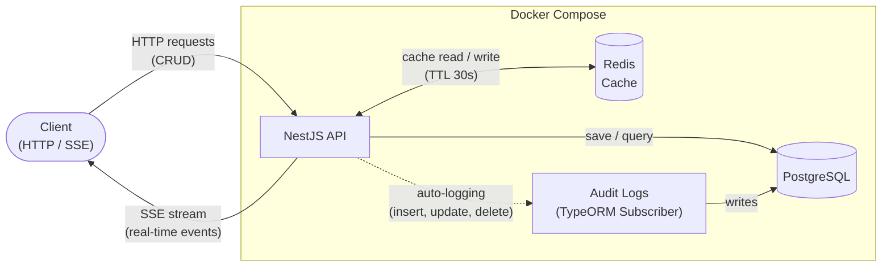

# TaskStream API

> **[Leia em Português](README.pt-BR.md)**

A RESTful task management API built with **NestJS**, featuring real-time events via **SSE (Server-Sent Events)**, **Redis** caching, **PostgreSQL** persistence, and automatic **audit logging** of every data change.

---

## Table of Contents

- [TaskStream API](#taskstream-api)
  - [Table of Contents](#table-of-contents)
  - [Features](#features)
  - [Tech Stack](#tech-stack)
  - [Architecture](#architecture)
  - [Getting Started](#getting-started)
    - [Prerequisites](#prerequisites)
    - [Environment Variables](#environment-variables)
    - [Running with Docker](#running-with-docker)
    - [Running Locally](#running-locally)
  - [API Endpoints](#api-endpoints)
    - [Create Task](#create-task)
    - [Update Task](#update-task)
    - [Delete Task](#delete-task)
    - [Task Statuses](#task-statuses)
  - [Real-Time Events (SSE)](#real-time-events-sse)
  - [Audit Logging](#audit-logging)
  - [Testing](#testing)
  - [Project Structure](#project-structure)
  - [License](#license)

---

## Features

- **CRUD** operations for tasks (Create, Read, Update, Delete)
- **Real-time notifications** via Server-Sent Events (SSE)
- **Redis caching** with automatic invalidation (30s TTL)
- **Automatic audit logging** — every insert, update, and delete is tracked
- **Swagger/OpenAPI** interactive documentation
- **Input validation** with class-validator (whitelist + transform)
- **UUID** primary keys
- **TypeORM** migrations (no `synchronize: true`)
- **Multi-stage Docker** build with non-root user
- **Health checks** for all services

---

## Tech Stack

| Layer     | Technology              |
| --------- | ----------------------- |
| Runtime   | Node.js ≥ 20            |
| Framework | NestJS 11               |
| Language  | TypeScript 5            |
| Database  | PostgreSQL 17           |
| ORM       | TypeORM 0.3             |
| Cache     | Redis 7 (via ioredis)   |
| Docs      | Swagger / OpenAPI 3     |
| Container | Docker + Docker Compose |
| Testing   | Jest + Supertest        |

---

## Architecture



**Request flow:**

1. **Client** sends HTTP requests (CRUD) or connects via SSE for real-time events
2. **GET /tasks** → checks **Redis** cache first; on miss, queries **PostgreSQL** and caches the result (30s TTL)
3. **POST / PATCH / DELETE** → persists in **PostgreSQL**, invalidates Redis cache, and emits an SSE event
4. **TypeORM Subscriber** → automatically logs every insert, update, and delete to the `audit_logs` table
5. **SSE stream** → all connected clients receive `task_created`, `task_updated`, or `task_deleted` events in real time

---

## Getting Started

### Prerequisites

- **Docker** and **Docker Compose** (recommended)
- Or: **Node.js ≥ 20**, **PostgreSQL 17**, **Redis 7**

### Environment Variables

Copy the example file and adjust as needed:

```bash
cp .env.example .env
```

| Variable         | Default          | Description         |
| ---------------- | ---------------- | ------------------- |
| `PORT`           | `3000`           | App listening port  |
| `NODE_ENV`       | `development`    | Environment mode    |
| `DB_HOST`        | `postgres`       | PostgreSQL host     |
| `DB_PORT`        | `5432`           | PostgreSQL port     |
| `DB_USER`        | `postgres`       | PostgreSQL user     |
| `DB_PASSWORD`    | `postgres`       | PostgreSQL password |
| `DB_NAME`        | `tasksdb`        | Database name       |
| `REDIS_HOST`     | `redis`          | Redis host          |
| `REDIS_PORT`     | `6379`           | Redis port          |
| `REDIS_PASSWORD` | `redis_password` | Redis password      |

### Running with Docker

```bash
# Start all services (app + postgres + redis)
docker compose up --build -d

# Check logs
docker compose logs -f app

# Stop everything
docker compose down
```

The API will be available at **http://localhost:3000** and Swagger docs at **http://localhost:3000/api**.

### Running Locally

```bash
# Install dependencies
npm install

# Make sure PostgreSQL and Redis are running locally
# Update .env with DB_HOST=localhost and REDIS_HOST=localhost

# Run migrations and start in dev mode
npm run build
npm run migration:run
npm run start:dev
```

---

## API Endpoints

| Method   | Endpoint        | Description                   |
| -------- | --------------- | ----------------------------- |
| `POST`   | `/tasks`        | Create a new task             |
| `GET`    | `/tasks`        | List all tasks (cached 30s)   |
| `GET`    | `/tasks/:id`    | Get a task by UUID            |
| `PATCH`  | `/tasks/:id`    | Update a task                 |
| `DELETE` | `/tasks/:id`    | Delete a task                 |
| `GET`    | `/tasks/events` | SSE stream — real-time events |

### Create Task

```bash
curl -X POST http://localhost:3000/tasks \
  -H "Content-Type: application/json" \
  -d '{"title": "Implement login page", "description": "Create login with email and password"}'
```

### Update Task

```bash
curl -X PATCH http://localhost:3000/tasks/<uuid> \
  -H "Content-Type: application/json" \
  -d '{"status": "in_progress"}'
```

### Delete Task

```bash
curl -X DELETE http://localhost:3000/tasks/<uuid>
```

### Task Statuses

| Status      | Value         |
| ----------- | ------------- |
| Pending     | `pending`     |
| In Progress | `in_progress` |
| Done        | `done`        |

> Full interactive documentation available at **http://localhost:3000/api** (Swagger UI).

---

## Real-Time Events (SSE)

Connect to the SSE stream to receive real-time notifications:

```bash
curl -N http://localhost:3000/tasks/events
```

Events emitted:

| Event          | Trigger           |
| -------------- | ----------------- |
| `task_created` | A task is created |
| `task_updated` | A task is updated |
| `task_deleted` | A task is deleted |

Each event payload contains the full task object (or `{ id }` for deletions).

---

## Audit Logging

Every mutation on tracked entities is automatically logged to the `audit_logs` table via a **TypeORM Entity Subscriber**. No manual code is needed in services.

| Column          | Description                                 |
| --------------- | ------------------------------------------- |
| `id`            | Audit log UUID                              |
| `event`         | `insert`, `update`, `soft_remove`, `remove` |
| `entity_id`     | UUID of the affected entity                 |
| `entity_name`   | Entity class name (e.g., `Task`)            |
| `entity_before` | JSON snapshot before the change             |
| `entity_after`  | JSON snapshot after the change              |
| `created_at`    | Timestamp of the audit entry                |

---

## Testing

```bash
# Unit tests
npm run test

# Watch mode
npm run test:watch

# Coverage report
npm run test:cov
```

---

## Project Structure

```
src/
├── main.ts                          # Bootstrap + Swagger setup
├── app.module.ts                    # Root module
├── config/
│   └── typeorm.ts                   # TypeORM DataSource config
├── database/
│   └── database.module.ts           # Registers audit subscriber
├── tasks/
│   ├── task.entity.ts               # Task entity
│   ├── task.enum.ts                 # TaskStatus enum
│   ├── tasks.controller.ts          # REST + SSE controller
│   ├── tasks.service.ts             # Business logic
│   ├── tasks.module.ts              # Tasks module
│   └── dto/
│       ├── create-task.dto.ts       # Create validation
│       └── update-task.dto.ts       # Update validation (partial)
├── audit-log/
│   ├── audit-log.entity.ts          # AuditLog entity
│   ├── audit-log.service.ts         # Audit persistence
│   └── audit-log.module.ts          # AuditLog module
├── events/
│   ├── events.interface.ts          # TaskEvent type
│   ├── events.service.ts            # In-memory SSE hub
│   └── events.module.ts             # Events module
├── redis/
│   ├── redis.service.ts             # Redis get/set/del wrapper
│   └── redis.module.ts              # Redis module
├── shared/
│   ├── entity/
│   │   └── base.entity.ts           # Abstract base entity (id, timestamps)
│   └── subscriber/
│       └── entity-audit.subscriber.ts # TypeORM subscriber for audit logs
└── migrations/
    ├── ...-CreateTasks.ts
    └── ...-CreateAuditLogs.ts
```

---

## License

This project is licensed under the [MIT License](LICENSE).
