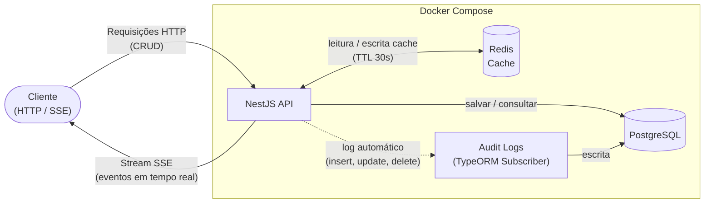

# TaskStream API

> **[Read in English](README.md)**

API RESTful para gerenciamento de tarefas construída com **NestJS**, com eventos em tempo real via **SSE (Server-Sent Events)**, cache com **Redis**, persistência em **PostgreSQL** e **audit log** automático de toda alteração nos dados.

---

## Índice

- [Funcionalidades](#funcionalidades)
- [Stack Tecnológica](#stack-tecnológica)
- [Arquitetura](#arquitetura)
- [Como Começar](#como-começar)
  - [Pré-requisitos](#pré-requisitos)
  - [Variáveis de Ambiente](#variáveis-de-ambiente)
  - [Rodando com Docker](#rodando-com-docker)
  - [Rodando Localmente](#rodando-localmente)
- [Endpoints da API](#endpoints-da-api)
- [Eventos em Tempo Real (SSE)](#eventos-em-tempo-real-sse)
- [Audit Log](#audit-log)
- [Testes](#testes)
- [Estrutura do Projeto](#estrutura-do-projeto)
- [Licença](#licença)

---

## Funcionalidades

- **CRUD** completo de tarefas (Criar, Listar, Atualizar, Remover)
- **Notificações em tempo real** via Server-Sent Events (SSE)
- **Cache com Redis** com invalidação automática (TTL de 30s)
- **Audit log automático** — cada insert, update e delete é rastreado
- **Swagger/OpenAPI** — documentação interativa
- **Validação de entrada** com class-validator (whitelist + transform)
- **UUID** como chave primária
- **TypeORM** com migrations (sem `synchronize: true`)
- **Docker multi-stage** com usuário não-root
- **Porta configurável** via variável de ambiente `PORT`

---

## Stack Tecnológica

| Camada         | Tecnologia              |
| -------------- | ----------------------- |
| Runtime        | Node.js ≥ 20            |
| Framework      | NestJS 11               |
| Linguagem      | TypeScript 5            |
| Banco de Dados | PostgreSQL 17           |
| ORM            | TypeORM 0.3             |
| Cache          | Redis 7 (via ioredis)   |
| Documentação   | Swagger / OpenAPI 3     |
| Container      | Docker + Docker Compose |
| Testes         | Jest + Supertest        |

---

## Arquitetura



**Fluxo da requisição:**

1. **Cliente** envia requisições HTTP (CRUD) ou conecta via SSE para eventos em tempo real
2. **GET /tasks** → verifica o cache no **Redis** primeiro; se não encontrar, consulta o **PostgreSQL** e armazena no cache (TTL de 30s)
3. **POST / PATCH / DELETE** → persiste no **PostgreSQL**, invalida o cache Redis e emite um evento SSE
4. **TypeORM Subscriber** → registra automaticamente cada insert, update e delete na tabela `audit_logs`
5. **Stream SSE** → todos os clientes conectados recebem eventos `task_created`, `task_updated` ou `task_deleted` em tempo real

---

## Como Começar

### Pré-requisitos

- **Docker** e **Docker Compose** (recomendado)
- Ou: **Node.js ≥ 20**, **PostgreSQL 17**, **Redis 7**

### Variáveis de Ambiente

Copie o arquivo de exemplo e ajuste conforme necessário:

```bash
cp .env.example .env
```

| Variável         | Padrão           | Descrição              |
| ---------------- | ---------------- | ---------------------- |
| `PORT`           | `3000`           | Porta da aplicação     |
| `NODE_ENV`       | `development`    | Modo do ambiente       |
| `DB_HOST`        | `postgres`       | Host do PostgreSQL     |
| `DB_PORT`        | `5432`           | Porta do PostgreSQL    |
| `DB_USER`        | `postgres`       | Usuário do PostgreSQL  |
| `DB_PASSWORD`    | `postgres`       | Senha do PostgreSQL    |
| `DB_NAME`        | `tasksdb`        | Nome do banco de dados |
| `REDIS_HOST`     | `redis`          | Host do Redis          |
| `REDIS_PORT`     | `6379`           | Porta do Redis         |
| `REDIS_PASSWORD` | `redis_password` | Senha do Redis         |

### Rodando com Docker

```bash
# Subir todos os serviços (app + postgres + redis)
docker compose up --build -d

# Verificar logs
docker compose logs -f app

# Parar tudo
docker compose down
```

A API estará disponível em **http://localhost:{PORT}** (padrão `3000`) e a documentação Swagger em **http://localhost:{PORT}/api**. A porta é controlada pela variável de ambiente `PORT`.

### Rodando Localmente

```bash
# Instalar dependências
npm install

# Certifique-se de que PostgreSQL e Redis estão rodando localmente
# Atualize o .env com DB_HOST=localhost e REDIS_HOST=localhost

# Rodar migrations e iniciar em modo dev
npm run build
npm run migration:run
npm run start:dev
```

---

## Endpoints da API

| Método   | Endpoint        | Descrição                           |
| -------- | --------------- | ----------------------------------- |
| `POST`   | `/tasks`        | Criar uma nova tarefa               |
| `GET`    | `/tasks`        | Listar todas as tarefas (cache 30s) |
| `GET`    | `/tasks/:id`    | Buscar tarefa por UUID              |
| `PATCH`  | `/tasks/:id`    | Atualizar uma tarefa                |
| `DELETE` | `/tasks/:id`    | Remover uma tarefa                  |
| `GET`    | `/tasks/events` | Stream SSE — eventos em tempo real  |

### Criar Tarefa

```bash
curl -X POST http://localhost:3000/tasks \
  -H "Content-Type: application/json" \
  -d '{"title": "Implementar página de login", "description": "Criar login com email e senha"}'
```

### Atualizar Tarefa

```bash
curl -X PATCH http://localhost:3000/tasks/<uuid> \
  -H "Content-Type: application/json" \
  -d '{"status": "in_progress"}'
```

### Remover Tarefa

```bash
curl -X DELETE http://localhost:3000/tasks/<uuid>
```

### Status das Tarefas

| Status       | Valor         |
| ------------ | ------------- |
| Pendente     | `pending`     |
| Em Progresso | `in_progress` |
| Concluída    | `done`        |

> Documentação interativa completa disponível em **http://localhost:3000/api** (Swagger UI).

---

## Eventos em Tempo Real (SSE)

Conecte-se ao stream SSE para receber notificações em tempo real:

```bash
curl -N http://localhost:3000/tasks/events
```

Eventos emitidos:

| Evento         | Gatilho                 |
| -------------- | ----------------------- |
| `task_created` | Uma tarefa é criada     |
| `task_updated` | Uma tarefa é atualizada |
| `task_deleted` | Uma tarefa é removida   |

Cada evento contém o objeto completo da tarefa (ou `{ id }` para remoções).

---

## Audit Log

Toda mutação em entidades rastreadas é automaticamente registrada na tabela `audit_logs` por meio de um **TypeORM Entity Subscriber**. Nenhum código manual é necessário nos services.

| Coluna          | Descrição                                   |
| --------------- | ------------------------------------------- |
| `id`            | UUID do audit log                           |
| `event`         | `insert`, `update`, `soft_remove`, `remove` |
| `entity_id`     | UUID da entidade afetada                    |
| `entity_name`   | Nome da classe da entidade (ex: `Task`)     |
| `entity_before` | Snapshot JSON antes da alteração            |
| `entity_after`  | Snapshot JSON depois da alteração           |
| `created_at`    | Timestamp do registro de auditoria          |

---

## Testes

```bash
# Testes unitários
npm run test

# Modo watch
npm run test:watch

# Relatório de cobertura
npm run test:cov
```

---

## Estrutura do Projeto

```
src/
├── main.ts                          # Bootstrap + setup do Swagger
├── app.module.ts                    # Módulo raiz
├── config/
│   └── typeorm.ts                   # Configuração do DataSource TypeORM
├── database/
│   └── database.module.ts           # Registra o subscriber de auditoria
├── tasks/
│   ├── task.entity.ts               # Entidade Task
│   ├── task.enum.ts                 # Enum TaskStatus
│   ├── tasks.controller.ts          # Controller REST + SSE
│   ├── tasks.service.ts             # Lógica de negócio
│   ├── tasks.module.ts              # Módulo Tasks
│   └── dto/
│       ├── create-task.dto.ts       # DTO de criação
│       └── update-task.dto.ts       # DTO de atualização (parcial)
├── audit-log/
│   ├── audit-log.entity.ts          # Entidade AuditLog
│   ├── audit-log.service.ts         # Persistência de auditoria
│   └── audit-log.module.ts          # Módulo AuditLog
├── events/
│   ├── events.interface.ts          # Tipo TaskEvent
│   ├── events.service.ts            # Hub SSE em memória
│   └── events.module.ts             # Módulo Events
├── redis/
│   ├── redis.service.ts             # Wrapper Redis get/set/del
│   └── redis.module.ts              # Módulo Redis
├── shared/
│   ├── entity/
│   │   └── base.entity.ts           # Entidade base abstrata (id, timestamps)
│   └── subscriber/
│       └── entity-audit.subscriber.ts # Subscriber TypeORM para audit logs
└── migrations/
    ├── ...-CreateTasks.ts
    └── ...-CreateAuditLogs.ts
```

---

## Licença

Este projeto está licenciado sob a [Licença MIT](LICENSE).
